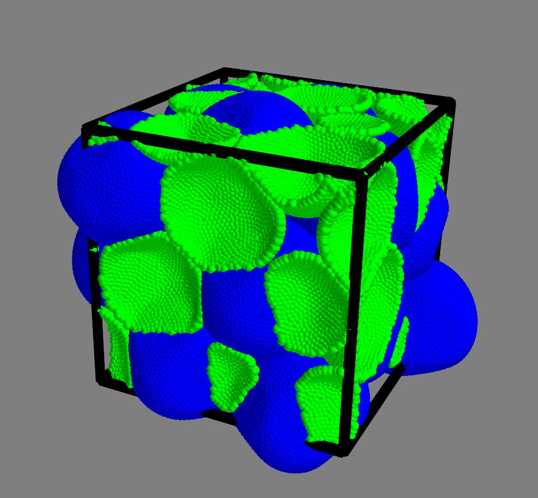

## DESCRIPTION ###
Visualize shells in a simulation box.  
Blue shells are the original one, and the green one are the PBC images.   

## USAGE ###

`./boxview.py ../../assets/data/packing.xyz 0.2`

COPYRIGHT NOTICE
================
Copyright (C) 2017-2018,  Pawel Gniewek  
Email  : gniewko.pablo@gmail.com  
All rights reserved.  
License: BSD

