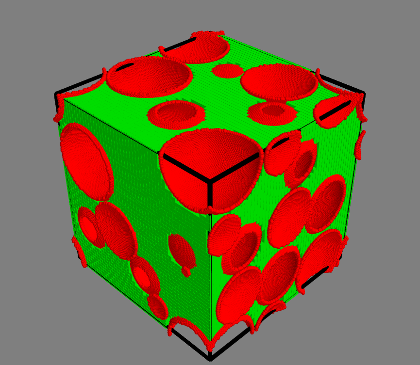

## DESCRIPTION ###
Find a percolating cluster and plot both shells and the percolating cluster. 

## USAGE ###

`./percoview.py ../../assets/data/packing.xyz 0.2 all`

COPYRIGHT NOTICE
================
Copyright (C) 2017-2018,  Pawel Gniewek  
Email  : gniewko.pablo@gmail.com  
All rights reserved.  
License: BSD

