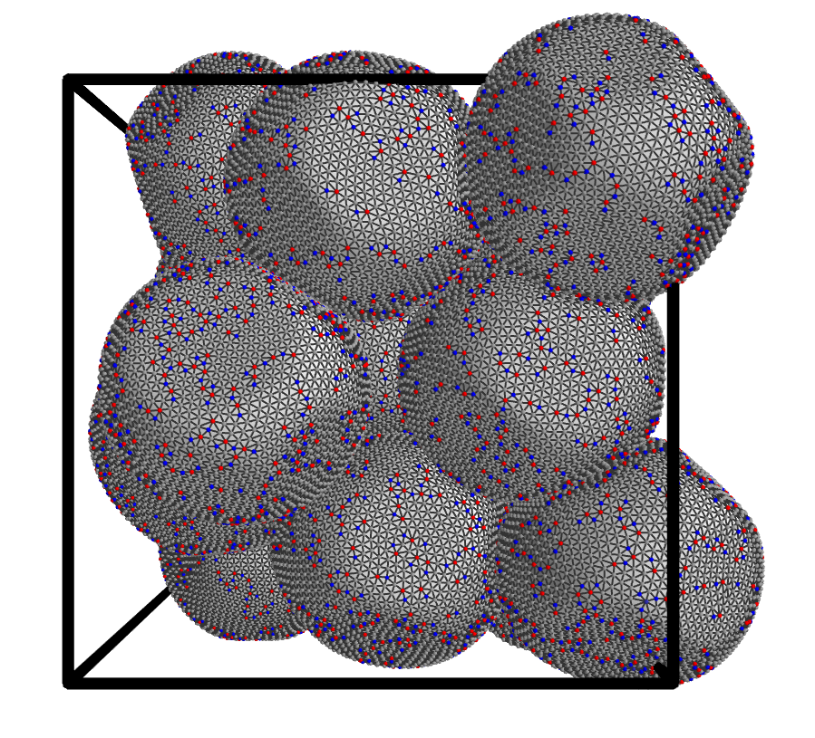

## DESCRIPTION ###
Visualize shells in a simulation box.

## USAGE ###

`./shellswire.py ../../assets/data/packing.xyz ../../assets/data/packing.top 1`

The input files come from the [elasticshells](https://github.com/pgniewko/elasticshells).

COPYRIGHT NOTICE
================
Copyright (C) 2017-2018,  Pawel Gniewek  
Email  : gniewko.pablo@gmail.com  
All rights reserved.  
License: BSD

