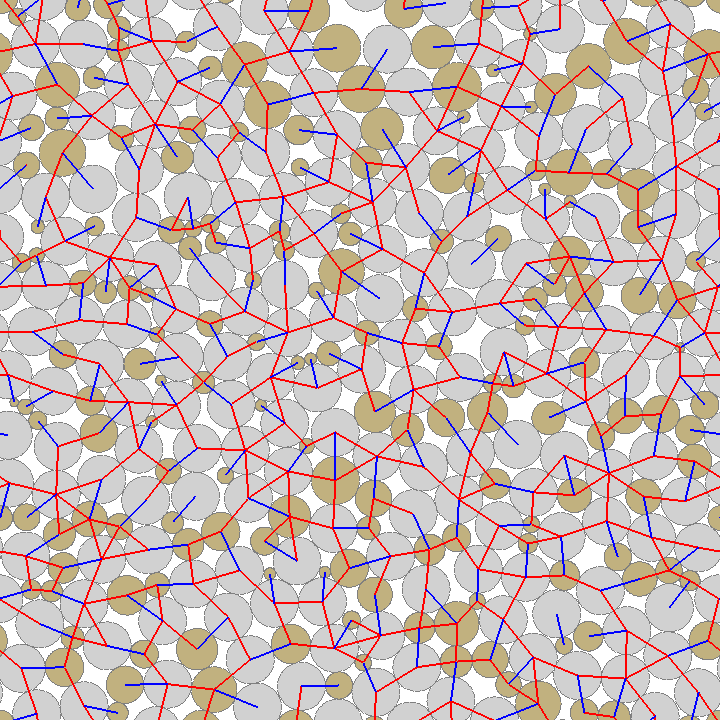

## DESCRIPTION ###
Visualize a colony of growing budding yeast cells.

## USAGE ###

`./simbox.py ../../assets/data/budding_yeast_tra.dat 8 0.0`

COPYRIGHT NOTICE
================
Copyright (C) 2017-2018,  Pawel Gniewek  
Email  : gniewko.pablo@gmail.com  
All rights reserved.  
License: BSD

